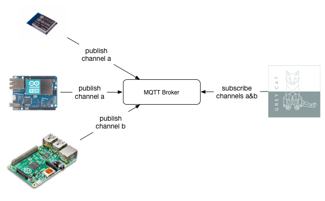

MQTT Plugin
=============

This plugin brings a MQTT connectivity to the GreyCat project. 

##What is MQTT?

[MQTT](http://mqtt.org/) is a machine-to-machine (M2M) protocol oriented for the Internet of Things. It is designed as a lightweight publish/subscribe messaging transport.



## How to use the plugin

```
GraphBuilder.newBuilder()
            .withPlugin(new MQTTPlugin(HOST_IP, HOST_PORT, TOPICS, INDEX))
            (...)
            .build();
```

* `HOST_IP` and `HOST_PORT` refer to the broker's IP/URL and port (eg. iot.eclipse.org 1883).
* `TOPICS` refers to the subscriptions
* `INDEX` refers to a GreyCat index (**ONLY** nodes registered in this index can be updated through MQTT)

See the test/ directory for more examples

## Payload format

The MQTT payload has to comply with the following JSON structure:

```
{"id":node_indexed_id,
"time":time,
"values":{ "attr1": {"value":"attr1_value", "type":"attr1_type"},
           "attr2": {"value":"attr2_value", "type":"attr2_type"},
            ...
            "attrn": {"value":"attrn_value", "type":"attrn_type"}
          }
}
```
where:
* `node_indexed_id` is the **indexed** attribute of the node (STRING)
* `time` is a UNIX timestamp
*  `values` contains a list of attributes to create or update for the specified timestamp:
    * `attr1` is the attribute's name
    * `value` is the attribute's value
    * `type` is the attribute's *GreyCat* type
    
### Example:
The following example shows a JSON payload received through a MQTT subscription:  
```json
{"id":"12",
"time":12345,
"values":{ "battery": {"value":"50.0", "type":"DOUBLE"},
           "measurement": {"value":"23.0", "type":"DOUBLE"},
           "unit": {"value":"CELSIUS", "type":"STRING"}
          }
}
```

## Writing a custom message handler

A custom message handler extends the `MessageHandler` abstract class and overrides the `messageArrived` method.
The `DefaultMessageHandler` class shows an implementation example.